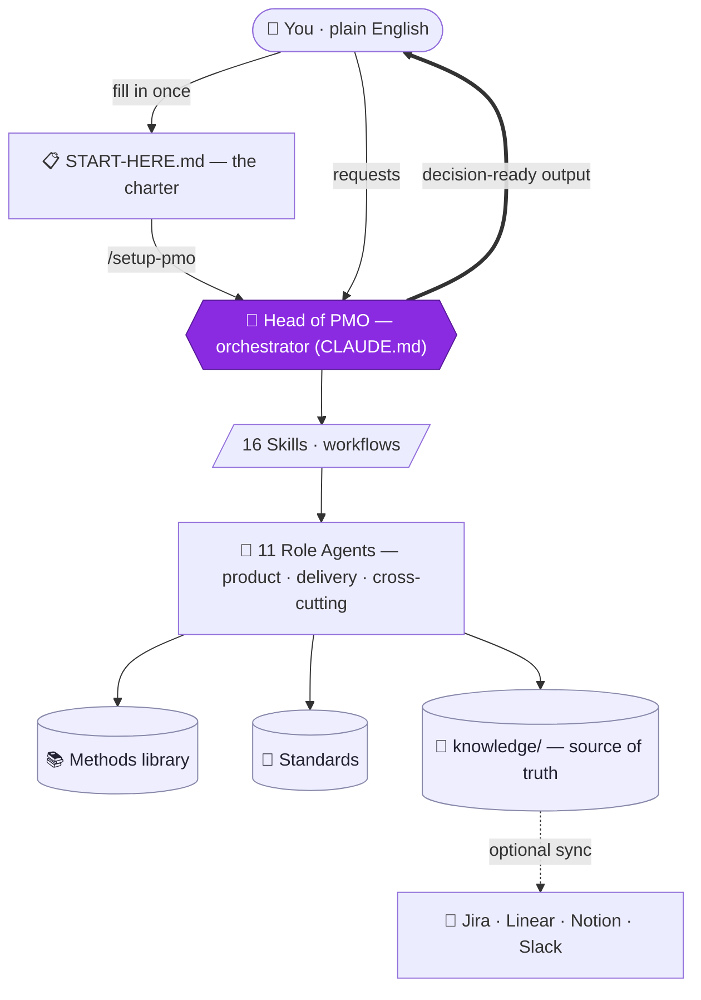
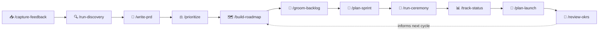

# 🧭 Agentic PMO for Claude Code

**A self-contained Product & Project Management Office, built from Claude sub-agents and skills.**
Fill in one charter, run one command, and get a virtual PMO that runs discovery, writes PRDs, prioritizes,
builds roadmaps, grooms backlogs, plans sprints and projects, tracks status, plans launches, facilitates
ceremonies, and produces stakeholder-ready deliverables — grounded in a built-in methods library and
persisted across sessions.


---

## Why this exists

A real PMO is a team of specialists working a shared operating rhythm: strategists, product managers,
owners, researchers, analysts, project and program managers, scrum masters, release managers. This kit
recreates that team as **11 role-based agents** coordinated by a **Head of PMO** orchestrator, driven by
**16 plain-English workflows**, and anchored by a **persistent memory** so decisions and context survive
across sessions.

You talk to it in business English — *"build me a roadmap," "write a PRD for X," "plan the next sprint,"
"give me a status report"* — and it routes the work to the right specialist, applies the right method, and
returns a decision-ready result.

## How it works



**Five moving parts:**

| Part | What it is |
|------|------------|
| 🧭 **Orchestrator** (`CLAUDE.md`) | The Head of PMO — routes requests, sequences multi-step work, runs the operating rhythm, owns final QA. |
| 👥 **Agents** (`.claude/agents/`) | 11 specialists, each scoped to a role with its own method playbook. |
| ⚙️ **Skills** (`.claude/skills/`) | 16 slash-command workflows that do the actual jobs. |
| 🧠 **Knowledge** (`knowledge/`) | Persistent memory — product context, roadmap, backlog, RAID, intake, decisions. The **source of truth**. |
| 📚📐 **Methods & Standards** | A reusable library of techniques (`knowledge/methods/`) and house style (`standards/`). |

## Quick start

> **Prerequisites:** [Claude Code](https://claude.com/claude-code) and this repository opened as your
> working project.

1. **Get the kit** — clone or download this repo and open it in Claude Code.
   ```bash
   git clone https://github.com/link7373/agentic-pmo.git
   cd agentic-pmo
   ```
2. **Fill out the charter** — open [`START-HERE.md`](START-HERE.md) and answer in plain English. "No idea"
   is a perfectly fine answer; the PMO will ask or use sensible defaults.
3. **Run setup** — in Claude Code, run:
   ```
   /setup-pmo
   ```
   It validates your answers, confirms your process conventions, seeds the `knowledge/` memory, and tells
   you what to do next.
4. **Just ask.** Talk to the Head of PMO in business English. Not sure what to do? Ask
   *"what should we work on this week?"* and it answers from the operating rhythm.

## The product → delivery lifecycle

Every workflow chains into the next. A new idea flows from the front door all the way to launch and back:



## The team — 11 agents

**Product**

| Agent | Owns |
|-------|------|
| `product-strategist` | Vision, strategy, positioning, business model, market sizing, OKRs |
| `product-manager` | PRDs, feature definition, prioritization, roadmap ownership, stakeholder management |
| `product-owner` | Backlog ownership, user stories, acceptance criteria, sprint-readiness |
| `discovery-researcher` | User/market research, interviews, personas, JTBD, problem/solution validation |
| `product-analyst` | Metrics, experimentation/A-B testing, product analytics, success measurement |

**Delivery / project**

| Agent | Owns |
|-------|------|
| `project-manager` | Project plans, WBS, schedule, scope & change control, RAID, status |
| `program-manager` | Cross-project coordination, dependencies, portfolio sequencing, capacity |
| `scrum-master` | Ceremony facilitation, impediment removal, team health, agile metrics |
| `release-manager` | Release planning, launch/GTM readiness, rollout & change management |

**Cross-cutting**

| Agent | Owns |
|-------|------|
| `delivery-monitor` | Status/velocity/burndown tracking, risk & anomaly surfacing, RAID & scorecards |
| `comms-lead` | Stakeholder & executive communications, audience-tailored deliverables |

## The workflows — 16 skills

| Skill | What it does | Lead agent |
|-------|--------------|------------|
| `/setup-pmo` | Initialize the PMO from the charter; seed memory | (orchestrator) |
| `/define-strategy` | Vision, positioning, business model, OKRs | product-strategist |
| `/review-okrs` | Grade OKRs, cycle check-in, carry learnings forward | product-strategist + product-analyst |
| `/capture-feedback` | Capture & triage inbound signals into the funnel | product-manager |
| `/run-discovery` | Validate problems; research, personas, JTBD | discovery-researcher |
| `/write-prd` | Product requirements document | product-manager |
| `/prioritize` | Rank work against goals (RICE / WSJF / Kano / …) | product-manager |
| `/build-roadmap` | Outcome/theme roadmap (Now / Next / Later) | product-manager + product-strategist |
| `/groom-backlog` | INVEST stories, acceptance criteria, ordering | product-owner |
| `/plan-sprint` | Sprint goal, capacity, selected items | scrum-master + product-owner |
| `/plan-capacity` | Balance load across teams; sequencing & trade-offs | program-manager + scrum-master |
| `/plan-project` | Scope, WBS, schedule, dependencies, RAID | project-manager |
| `/track-status` | RAG status, velocity/burndown, RAID update | delivery-monitor → comms-lead |
| `/run-ceremony` | Facilitate planning / standup / review / retro | scrum-master |
| `/plan-launch` | Rollout strategy, readiness, go/no-go | release-manager |
| `/make-deliverable` | Audience-tailored exec/board/status communication | comms-lead |

## The methods library

A shared, reusable set of techniques every agent draws on (`knowledge/methods/`):

`product-strategy` · `lean-product-process` · `discovery-and-validation` · `prioritization-frameworks` ·
`requirements-and-stories` · `agile-scrum-mechanics` · `project-management` · `roadmapping` ·
`launch-and-gtm` · `metrics-and-experimentation`

## Memory & the operating rhythm

The PMO remembers. Everything lives in `knowledge/` as the single source of truth:

- **Context:** `product-context.md`, `stakeholder-map.md`, `cadence.md`, `glossary.md`
- **Work:** `roadmap.md`, `backlog.md`, `intake.md` (the front door), `raid-log.md`
- **Artifacts:** `prds/`, `sprints/`, `projects/`, `launches/`, `ceremonies/`
- **Governance:** `decision-log.md` (a traceable record of consequential decisions)
- **Cadence:** `operating-rhythm.md` — what happens daily / weekly / per-sprint / per-quarter, each step
  tied to the skill that performs it. The Head of PMO runs this rhythm, not just one-off requests, and the
  recurring items can be automated with scheduled routines.

## Templates

Every deliverable starts from a fill-in template in [`templates/`](templates/README.md) — PRD, status
report, sprint plan, project plan, launch plan, persona, OKRs, and executive update — so output is
consistent and fast.

## Standards

House style lives in `standards/`: `document-standards.md` (artifact structure, decision-log format),
`communication-standards.md` (audience playbook, BLUF, RAG discipline), and `agile-standards.md`
(story format, Definition of Ready/Done, estimation).

## See it in action

[`examples/sample-product/`](examples/README.md) contains a worked example — a fictional product, "Cadence" —
with a filled-in charter, the seeded product context, a real PRD, and a Now/Next/Later roadmap, so you can
calibrate the quality bar before running your own. (It's illustrative only; the live PMO reads from
`knowledge/`, not `examples/`.)

## Integrations & configuration

Files are canonical. **Optional** sync to external tools is configured in
[`knowledge/integrations.md`](knowledge/integrations.md):

- Skills that manage trackable items (`/groom-backlog`, `/plan-sprint`, `/track-status`, `/make-deliverable`)
  update the `knowledge/` file **first**, then offer to push to a configured tool (Jira / Linear / Notion /
  Slack) via its connector.
- If nothing is configured, everything runs **file-only** — no setup, no dependencies, fully portable.

## Repository layout

```
agentic-pmo/
├─ START-HERE.md            # the charter you fill in
├─ CLAUDE.md                # Head of PMO orchestrator (routing, rhythm, QA)
├─ README.md
├─ LICENSE · .gitignore · .gitattributes
├─ .claude/
│  ├─ agents/               # 11 role sub-agents
│  └─ skills/               # 16 slash-command workflows
├─ knowledge/               # persistent memory — source of truth
│  ├─ product-context.md · stakeholder-map.md · roadmap.md · backlog.md
│  ├─ raid-log.md · cadence.md · intake.md · glossary.md
│  ├─ operating-rhythm.md · integrations.md · decision-log.md
│  ├─ methods/              # 10 reusable technique files
│  └─ prds/ sprints/ projects/ launches/ ceremonies/   # generated artifacts
├─ templates/               # fill-in deliverable templates
├─ standards/               # document · communication · agile house style
└─ examples/                # worked sample product ("Cadence")
```

## Extending the team

- **Add a role:** drop a new file in `.claude/agents/` (frontmatter `name`, `description`, scoped `tools`),
  give it a method playbook, and add it to the routing matrix in `CLAUDE.md`.
- **Add a workflow:** create `.claude/skills/<name>/SKILL.md` with when-to-use, the agent it dispatches,
  inputs, methods, steps, and output location.
- **Add a technique:** add a file to `knowledge/methods/` and reference it from the agents/skills that use it
  (keep techniques in the shared library rather than duplicating them).

## Principles

- **Knowledge base is law** — every decision traces to `knowledge/` and `knowledge/methods/`.
- **Outcomes over output** — everything ladders to a goal/OKR and a customer/business outcome.
- **Honest and decision-ready** — assumptions and confidence stated; no green-washing.

## License & disclaimer

Released under the [MIT License](LICENSE). This kit produces plans, analyses, and recommendations to assist
human judgment — it does not replace it. Review the PMO's outputs before acting on them, especially for
scope, schedule, and external commitments.
