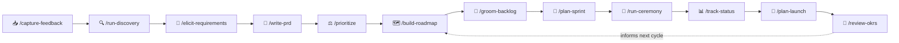

# 🧭 Agentic PMO for Claude Code

> **Created by Colin Beck**<br>
> LinkedIn: https://www.linkedin.com/in/beckcolin/<br>
> GitHub: https://github.com/link7373

**A self-contained Product & Project Management Office, built from Claude sub-agents and skills.**
Fill in one charter, run one command, and get a virtual PMO that runs discovery, writes PRDs, prioritizes,
builds roadmaps, grooms backlogs, plans sprints and projects, tracks status, plans launches, facilitates
ceremonies, and produces stakeholder-ready deliverables — grounded in a built-in methods library and
persisted across sessions.


---

## Why this exists

A real PMO is a team of specialists working a shared operating rhythm: strategists, product managers,
owners, researchers, analysts, project, program and portfolio managers, scrum masters, release managers. This
kit recreates that team as **17 role-based agents** coordinated by a **Head of PMO** orchestrator, driven by
**30 plain-English workflows**, and anchored by a **persistent memory** so decisions and context survive
across sessions.

You talk to it in business English — *"build me a roadmap," "write a PRD for X," "plan the next sprint,"
"give me a status report"* — and it routes the work to the right specialist, applies the right method, and
returns a decision-ready result.

## How it works


**Five moving parts:**

| Part | What it is |
|------|------------|
| 🧭 **Orchestrator** (`CLAUDE.md`) | The Head of PMO — routes requests, sequences multi-step work, runs the operating rhythm, owns final QA. |
| 👥 **Agents** (`.claude/agents/`) | 17 specialists, each scoped to a role with its own method playbook. |
| ⚙️ **Skills** (`.claude/skills/`) | 30 slash-command workflows that do the actual jobs. |
| 🧠 **Knowledge** (`knowledge/`) | Persistent memory — product context, roadmap, backlog, portfolio, RAID, intake, decisions. The **source of truth**. |
| 📚📐 **Methods & Standards** | A reusable library of techniques (`knowledge/methods/`) and house style (`standards/`). |

## Quick start

> **Prerequisites:** [Claude Code](https://claude.com/claude-code) and this repository opened as your
> working project.

1. **Get the kit** — clone or download this repo and open it in Claude Code.
   ```bash
   git clone https://github.com/link7373/agentic-pmo.git
   cd agentic-pmo
   ```
2. **Fill out the charter** — open [`START-HERE.md`](START-HERE.md) and answer in plain English. "No idea"
   is a perfectly fine answer; the PMO will ask or use sensible defaults.
3. **Run setup** — in Claude Code, run:
   ```
   /setup-pmo
   ```
   It validates your answers, confirms your process conventions, seeds the `knowledge/` memory, and tells
   you what to do next.
4. **Just ask.** Talk to the Head of PMO in business English. Not sure what to do? Ask
   *"what should we work on this week?"* and it answers from the operating rhythm.

## The product → delivery lifecycle

Every workflow chains into the next. A new idea flows from the front door all the way to launch and back:



## The team — 17 agents

**Product**

| Agent | Owns |
|-------|------|
| `product-strategist` | Vision, strategy, positioning, business model, market sizing, OKRs |
| `product-manager` | PRDs, feature definition, prioritization, roadmap ownership, stakeholder management |
| `product-owner` | Backlog ownership, user stories, acceptance criteria, sprint-readiness |
| `discovery-researcher` | User/market research, interviews, personas, JTBD, problem/solution validation |
| `product-analyst` | Metrics, experimentation/A-B testing, product analytics, success measurement |
| `business-analyst` | Elicitation, requirements analysis/classification, current/future-state & process modeling, traceability, solution evaluation |

**Delivery / project**

| Agent | Owns |
|-------|------|
| `project-manager` | Project plans, WBS, schedule, scope & change control, RAID, status, closure |
| `program-manager` | Cross-project coordination, dependencies, portfolio sequencing, capacity |
| `portfolio-analyst` | The portfolio data layer: register, status-intake quality gates, demand & capacity analytics, cross-portfolio collisions, dashboard & automation specs |
| `resource-manager` | The supply side of capacity: people & roles register, allocations & utilization, vendors & contractors, scarce-skill constraints |
| `scrum-master` | Ceremony facilitation, impediment removal, team health, agile metrics |
| `release-manager` | Release planning, launch/GTM readiness, rollout & change management |

**Cross-cutting**

| Agent | Owns |
|-------|------|
| `financial-analyst` | Business cases (ROI/NPV/payback), cost baselines, actuals vs. forecast, CPI/EAC/VAC, funding envelopes, benefits realization |
| `governance-lead` | Stage gates, decision rights & escalation, risk scoring & appetite, change-control policy, steerco mechanics, closure quality, lessons learned |
| `delivery-monitor` | Status/velocity/burndown tracking, risk & anomaly surfacing, RAID & scorecards |
| `comms-lead` | Stakeholder & executive communications, audience-tailored deliverables |
| `powerbi-validator` | Deterministic validation of Power BI projects before they reach Desktop or a stakeholder |

## The workflows — 30 skills

| Skill | What it does | Lead agent |
|-------|--------------|------------|
| `/setup-pmo` | Initialize the PMO from the charter; seed memory | (orchestrator) |
| `/define-strategy` | Vision, positioning, business model, OKRs | product-strategist |
| `/review-okrs` | Grade OKRs, cycle check-in, carry learnings forward | product-strategist + product-analyst |
| `/capture-feedback` | Capture & triage inbound signals into the funnel | product-manager |
| `/run-discovery` | Validate problems; research, personas, JTBD | discovery-researcher |
| `/elicit-requirements` | Elicit & analyze requirements, model process, classify & trace | business-analyst |
| `/write-prd` | Product requirements document | product-manager |
| `/prioritize` | Rank work against goals (RICE / WSJF / Kano / …) | product-manager |
| `/build-roadmap` | Outcome/theme roadmap (Now / Next / Later) | product-manager + product-strategist |
| `/groom-backlog` | INVEST stories, acceptance criteria, ordering | product-owner |
| `/plan-sprint` | Sprint goal, capacity, selected items | scrum-master + product-owner |
| `/plan-capacity` | Balance load across teams; sequencing & trade-offs | program-manager + resource-manager |
| `/manage-resources` | People, allocations, utilization, vendors, constraints | resource-manager |
| `/plan-project` | Scope, WBS, schedule, dependencies, RAID | project-manager |
| `/coordinate-program` | Cross-team dependency map, sequencing, integration, WIP | program-manager |
| `/track-status` | RAG status, velocity/burndown, RAID update | delivery-monitor → comms-lead |
| `/define-metrics` | North star, guardrails, exact definitions, funnels | product-analyst |
| `/review-portfolio-intake` | Quality-gate PM/PgM submissions; confidence per item | portfolio-analyst |
| `/track-portfolio` | Portfolio rollup: themes, collisions, capacity, two-tier report | portfolio-analyst + delivery-monitor → comms-lead |
| `/design-dashboard` | Spec a portfolio dashboard: model, measures, drill paths | portfolio-analyst + comms-lead |
| `/powerbi` | Build the dashboard as a PBIP project; validate before it opens | portfolio-analyst + powerbi-validator |
| `/plan-portfolio-automation` | Spec status-intake & data-flow automation | portfolio-analyst |
| `/run-ceremony` | Facilitate planning / standup / review / retro | scrum-master |
| `/plan-launch` | Rollout strategy, readiness, go/no-go | release-manager |
| `/build-business-case` | Options incl. do-nothing, whole-life cost, ROI/NPV, benefits | financial-analyst |
| `/track-financials` | Actuals vs. baseline, CPI/EAC, envelopes, benefits check | financial-analyst |
| `/manage-change` | Assess impact, get approval, re-baseline | project-manager + financial-analyst |
| `/run-gate-review` | Evidence vs. criteria; go / conditions / hold / kill | governance-lead |
| `/close-project` | Accept, final actuals, hand over benefits, capture lessons | project-manager |
| `/make-deliverable` | Audience-tailored exec/board/status communication | comms-lead |

## The methods library

A shared, reusable set of techniques every agent draws on (`knowledge/methods/`):

`product-strategy` · `lean-product-process` · `discovery-and-validation` · `prioritization-frameworks` ·
`requirements-and-stories` · `business-analysis` · `agile-scrum-mechanics` · `project-management` ·
`portfolio-management` · `roadmapping` · `launch-and-gtm` · `metrics-and-experimentation` ·
`financial-management` · `governance-and-change` · `resource-management`

## Memory & the operating rhythm

The PMO remembers. Everything lives in `knowledge/` as the single source of truth:

- **Context:** `product-context.md`, `stakeholder-map.md`, `cadence.md`, `glossary.md`
- **Work:** `roadmap.md`, `backlog.md`, `intake.md` (the front door), `raid-log.md`, `portfolio.md` (the register)
- **Money & people:** `financials.md` (baselines, actuals, EVM, benefits register), `resources.md` (people,
  allocations, utilization, vendors)
- **Definitions:** `portfolio-measures.md` for delivery measures and `metrics.md` for product metrics — one
  definition per name; the contract a dashboard build implements
- **Artifacts:** `prds/`, `sprints/`, `projects/`, `launches/`, `ceremonies/`, `portfolio/`, `discovery/`,
  `status/`, `capacity/`, `programs/`, `financials/`, `deliverables/`
- **Governance:** `governance.md` (gates, decision rights, escalation, risk appetite), `change-log.md`
  (every move to an approved baseline), `lessons-learned.md`, and `decision-log.md` (a traceable record of
  consequential decisions)
- **Cadence:** `operating-rhythm.md` — what happens daily / weekly / per-sprint / monthly / per-quarter, each step
  tied to the skill that performs it. The Head of PMO runs this rhythm, not just one-off requests, and the
  recurring items can be automated with scheduled routines.

## Templates

Every deliverable starts from a fill-in template in [`templates/`](templates/README.md) — PRD, requirements
package, status report, sprint plan, retro, project plan, capacity plan, launch plan, persona, roadmap, OKRs,
business case, change request, gate review, closure report, executive update, steerco pack, portfolio report,
dashboard spec, and automation spec — so output is consistent and fast.

## Standards

House style lives in `standards/`: `document-standards.md` (artifact structure, decision-log format),
`communication-standards.md` (audience playbook, BLUF, RAG discipline), `agile-standards.md`
(story format, Definition of Ready/Done, estimation), `dashboard-standards.md` (layout, chart selection,
colour and colour-blind safety, honesty rules — the single authority for design), and
`powerbi-standards.md` (Power BI mechanics only: project layout, naming, semantic model, the validation gate).

## See it in action

[`examples/sample-product/`](examples/README.md) contains a worked example — a fictional product, "Cadence" —
with a filled-in charter, the seeded product context, a real PRD, and a Now/Next/Later roadmap, so you can
calibrate the quality bar before running your own. (It's illustrative only; the live PMO reads from
`knowledge/`, not `examples/`.)

## Integrations & configuration

Files are canonical. **Optional** sync to external tools is configured in
[`knowledge/integrations.md`](knowledge/integrations.md):

- Skills that manage trackable items (`/groom-backlog`, `/plan-sprint`, `/track-status`, `/track-portfolio`,
  `/make-deliverable`) update the `knowledge/` file **first**, then offer to push to a configured tool (Jira /
  Linear / Notion / Slack) via its connector.
- If nothing is configured, everything runs **file-only** — no setup, no dependencies, fully portable.

## Power BI dashboards as code

Portfolio dashboards aren't only specified — they're **built**. `/design-dashboard` writes the spec (questions,
grain, measure catalog, layout, drill paths); `/powerbi` builds it as a **PBIP project** — semantic model in
TMDL, pages and visuals in PBIR, theme JSON — which is plain text, so a dashboard is diffed, reviewed and
version-controlled like any other artifact. A deterministic validator catches the failures that don't announce
themselves (the misnamed folder Desktop silently drops, the BOM that stops the project opening at all), and
`powerbi-validator` runs an independent pass before anything reaches a stakeholder.

Capability scales with what's installed — from spec-only, through full project authoring (Power BI Desktop plus
Python, the default), to a workspace-connected deployment. **Spec-only is a legitimate stop**, not a failure.

Two things the kit is deliberately honest about: a project that validates is only *well-formed* — it isn't done
until it renders in Desktop and every number reconciles against the register it came from. And portfolio
automation (Power Automate, OnePlan, Jira-side flows) has **no build capability** — those skills produce
specifications a person implements, and say so.

## Repository layout

```
agentic-pmo/
├─ START-HERE.md            # the charter you fill in
├─ CLAUDE.md                # Head of PMO orchestrator (routing, rhythm, QA)
├─ README.md
├─ LICENSE · .gitignore · .gitattributes
├─ .claude/
│  ├─ agents/               # 17 role sub-agents
│  └─ skills/               # 30 slash-command workflows
├─ knowledge/               # persistent memory — source of truth
│  ├─ product-context.md · stakeholder-map.md · roadmap.md · backlog.md
│  ├─ raid-log.md · cadence.md · intake.md · glossary.md · portfolio.md
│  ├─ portfolio-measures.md · operating-rhythm.md · integrations.md · decision-log.md
│  ├─ methods/              # 15 reusable technique files
│  └─ prds/ sprints/ projects/ launches/ ceremonies/ portfolio/   # generated artifacts
├─ dashboards/              # built dashboard projects (PBIP, plain text, tracked)
├─ templates/               # fill-in deliverable templates
├─ standards/               # document · communication · agile · dashboard · Power BI
└─ examples/                # worked sample product ("Cadence")
```

## Extending the team

- **Add a role:** drop a new file in `.claude/agents/` (frontmatter `name`, `description`, scoped `tools`),
  give it a method playbook, and add it to the routing matrix in `CLAUDE.md`.
- **Add a workflow:** create `.claude/skills/<name>/SKILL.md` with when-to-use, the agent it dispatches,
  inputs, methods, steps, and output location.
- **Add a technique:** add a file to `knowledge/methods/` and reference it from the agents/skills that use it
  (keep techniques in the shared library rather than duplicating them).

## Principles

- **Knowledge base is law** — every decision traces to `knowledge/` and `knowledge/methods/`.
- **Outcomes over output** — everything ladders to a goal/OKR and a customer/business outcome.
- **Honest and decision-ready** — assumptions and confidence stated; no green-washing.

## License & disclaimer

Released under the [MIT License](LICENSE). This kit produces plans, analyses, and recommendations to assist
human judgment — it does not replace it. Review the PMO's outputs before acting on them, especially for
scope, schedule, and external commitments.
